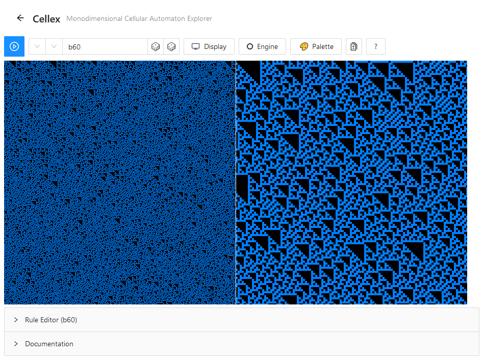
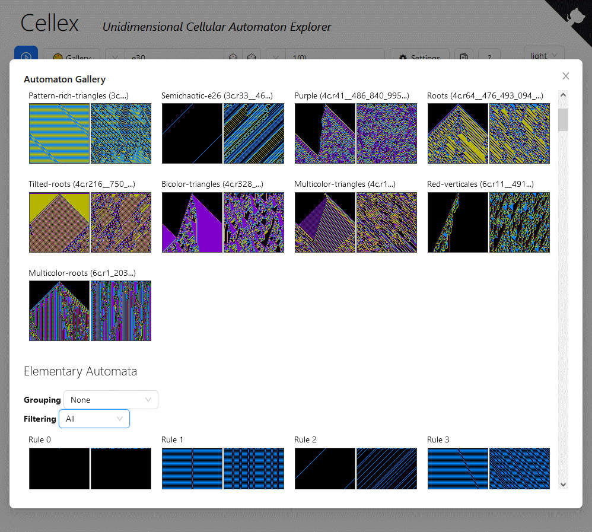

# [Cellex](https://mathieucaroff.com/cellex)

A unidimensional cellular automata explorer. It supports up to 16 colors, and
a neigborhood range of up to 11 cells.

### Cellex main view

### Cellex Gallery

## What are unidimensiontal cellular automata?

See the following ressources for introduction:

- [Introduction to the 1D Simulators](https://elife-asu.github.io/wss-modules/modules/1-1d-cellular-automata/)
- [Wikipedia's page on elementary automata](https://en.wikipedia.org/wiki/Elementary_cellular_automaton)

## Features

Cellex supports panning, moving around with the mouse or the keyboard as well as autoscroll down and varying the autoscroll speed. It also features an adjustable zoomed up view. It also supports user-based differential propagation view.

The engine supports up to 16 states and a transition function of size 4096 at most. Thus, neighborhood size can go up to 11 when the number of state is 2.

## Limits

The current UI limits the number of states to seven because for now the palette is composed of seven colors.

## Other cellular automata explorers

- [WolframAlpha](https://www.wolframalpha.com/input/?i=rule+110) – Description (symmetries, properties, classes), and differential propagation examples

_All the below explorers are limited to elementary automata_

- [Cellexp](https://mathieucaroff.com/cellexp) – Autoscrolling, Speed, Impuse, Zoom, Size, Navigation, Border, Random, Properties, Symmetrics
- [Celldemo](http://devinacker.github.io/celldemo/) – Autoscrolling, Impuse, Random, Start patterns (three),
- [ECAX](https://www.xanxys.net/ecax/) – Zoom, Navigation, Compute-on-demand
- ~~[ECA Canvas](http://www.cs.swan.ac.uk/~csandy/research/play/ca/) – Size, Border, Random~~ csandy has been removed OnO
- ~~[ECA EmergentMind](http://www.emergentmind.com/elementary-cellular-automata) - Zoom, Board of 256 rules~~ has been removed as well

## License

See [JAM license](https://opensource.org/license/jam/)
