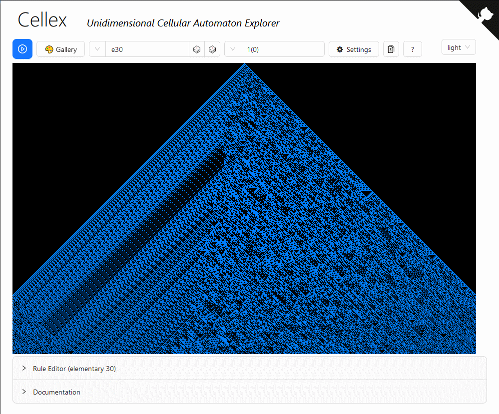

# [Cellex](https://mathieucaroff.com/cellex)

A monodimensional cellular automaton explorer. Unlike CellexP, it supports
**arbitrary rules**, not just the elementary cellular automata.

## Features

Cellex supports panning, moving around with the mouse or the keyboard as well as autoscroll down and varying the autoscroll speed. It also features an adjustable zoomed up view.

The engine supports up to 16 states and a transition function of size 4096 at most. Thus, neighborhood size can go up to 11 when the number of state is 2. Note that the current user interface does not allow to set such automata.

## Other cellular automata explorers

_All the below explorers are limited to elementary automata_

- [Cellexp](https://mathieucaroff.com/cellexp) – Autoscrolling, Speed, Impuse, Zoom, Size, Navigation, Border, Random, Properties, Symmetrics
- [Celldemo](http://devinacker.github.io/celldemo/) – Autoscrolling, Impuse, Random proportion,
- [ECAX](https://www.xanxys.net/ecax/) – Zoom, Navigation, Compute-on-demand
- [ECA Canvas](http://www.cs.swan.ac.uk/~csandy/research/play/ca/) – Size, Border, Random
- [ECA EmergentMind](http://www.emergentmind.com/elementary-cellular-automata) - Zoom, Board of 256 rules
- [WolframAlpha](https://www.wolframalpha.com/input/?i=rule+110) – Description (symmetries, properties, classes), Differential propagation examples
