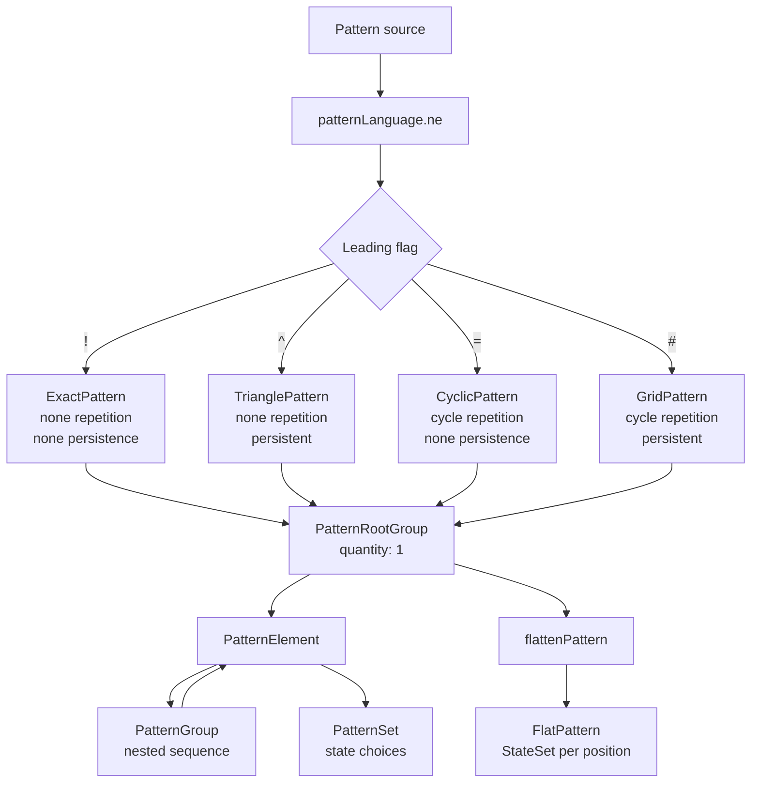

# Pattern Language AST

`PatternType.ts` defines the parsed representation produced by `patternLanguage.ne`.
The leading flag determines the pattern mode; the following group provides its content.

- `quantity` repeats a group or state set; `width` is its expanded horizontal size.
- `visibility` controls whether an element contributes to the flattened result.
- A `StateSet` is the allowed numeric states for one position; multiple values express a choice.
